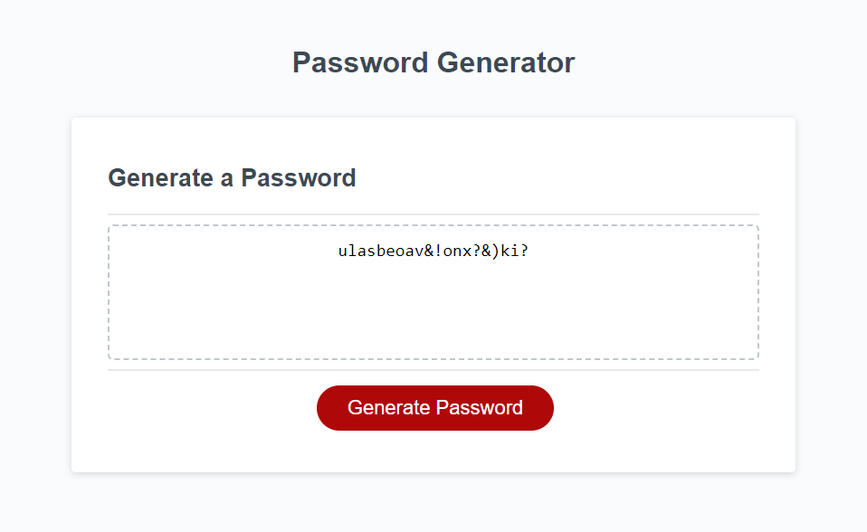

# Password Generator

I have modified the starter code to an application that allows users to generate random passwords based on the criteria they have selected.

1. When the user clicks the "Generate Password" button, a series of prompts are asked for password criteria including how long they want the password to be and whether they want to include numbers, uppercase and lowercase letters, and special characters. 

**Note**: If the user selects a password that is too short or too long, the generator will prompt them to select a length within 8 to 128 characters long. 

2. The generated password is presented on the webpage! 😊